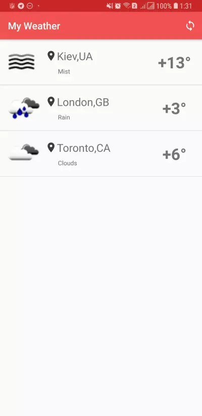

## MyWeather



Simple [OpenWeatherMap](https://api.openweathermap.org/data/2.5/group) client for show weather in some cities

Written on pure Kotlin with Android Architecture Components and Jetpack.

Use for build and install debug application next command:
```bash
./gradlew installDebug 
```

# Checklist

- [x] Prototype
- [ ] Tests
- [ ] CI